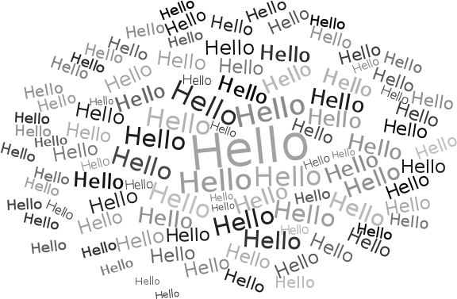
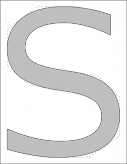
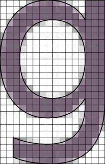
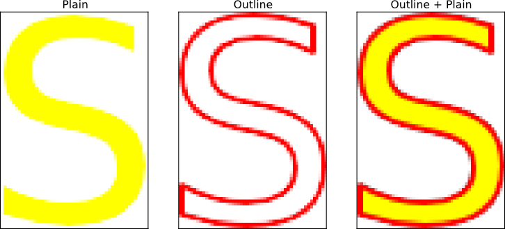
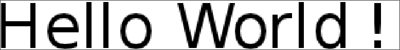
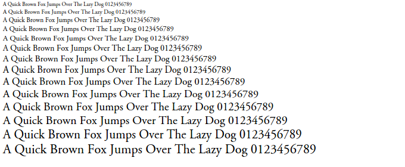

===========
Screenshots
===========

Screenshot below comes from the wordle.py example. No clever tricks here, just
brute force.

Screenshots below comes from the glyph-vector.py and glyph-vectopr-2.py
examples showing how to access a glyph outline information and use it to draw
the glyph. Rendering (with Bézier curves) is done using matplotlib.

Screenshot below comes from the glyph-color.py showing how to draw and combine
a glyph outline with the regular glyph.

The screenshot below comes from the hello-world.py example showing how to draw
text in a bitmap (that has been zoomed in to show antialiasing).

The screenshot below comes from the agg-trick.py example showing an
implementation of ideas from the `Texts Rasterization Exposures
<http://agg.sourceforge.net/antigrain.com/research/font_rasterization/>`_ by
Maxim Shemarev.

